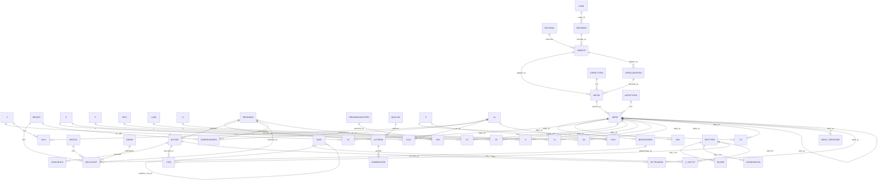

```mermaid
erDiagram
    A {}
    AUTOREN {}
    BEGART {}
    BEGEHUNGEN {}
    BEGSTIL {}
    BILDER {}
    C {}
    E {}
    GEBIETE {}
    GESTEINE {}
    GIPFEL {}
    GIPFELGRUPPEN {}
    GIPFELTYPEN {}
    GRADE {}
    INFO {}
    KOMMENTARE {}
    KOORDINATEN {}
    LAGE {}
    LAND {}
    MSL {}
    N {}
    NUTZER {}
    PERSONEN {}
    PERSONENGRUPPEN {}
    QUELLEN {}
    REGIONEN {}
    S {}
    SEILSCHAFT {}
    SL {}
    SLBEGEHUNGEN {}
    TAGESNOTIZ {}
    TAGS {}
    VA {}
    VC {}
    VE {}
    VI {}
    VL {}
    VN {}
    VPG {}
    VS {}
    VSLA {}
    VSLC {}
    VSLS {}
    VTAG {}
    V_TAGTYP {}
    WEGE {}
    WEGETYPEN {}
    WEGE_VERSIONEN {}
    ZETTELWEGE {}
    ZIELTYPEN {}
    PERSONEN ||--o{ AUTOREN : "PERSON_ID"
    QUELLEN ||--o{ AUTOREN : "QUELLE"
    WEGE ||--o{ BEGEHUNGEN : "WEG_ID"
    ZIELTYPEN ||--o{ BILDER : "ZIEL_TYP"
    GESTEINE ||--o{ GEBIETE : "GESTEIN"
    REGIONEN ||--o{ GEBIETE : "REGION_ID"
    GEBIETE ||--o{ GIPFEL : "GEBIET_ID"
    GIPFELGRUPPEN ||--o{ GIPFEL : "GRUPPE_ID"
    GIPFELTYPEN ||--o{ GIPFEL : "TYP"
    GEBIETE ||--o{ GIPFELGRUPPEN : "GEBIET_ID"
    AUTOREN ||--o{ KOMMENTARE : "AUTOR"
    ZIELTYPEN ||--o{ KOORDINATEN : "ZIEL_TYP"
    WEGE ||--o{ MSL : "WEG_ID"
    PERSONEN ||--o{ NUTZER : "PERSON"
    LAND ||--o{ REGIONEN : "LAND_ID"
    BEGART ||--o{ SEILSCHAFT : "ART"
    BEGEHUNGEN ||--o{ SEILSCHAFT : "BEGEHUNG_ID"
    GRADE ||--o{ SEILSCHAFT : "GRDXBEG"
    PERSONEN ||--o{ SEILSCHAFT : "PERSON_ID"
    BEGSTIL ||--o{ SEILSCHAFT : "STIL"
    BEGART ||--o{ SLBEGEHUNGEN : "SL_ART"
    SL ||--o{ SLBEGEHUNGEN : "SL_ID"
    PERSONEN ||--o{ SLBEGEHUNGEN : "VORSTEIGER"
    NUTZER ||--o{ TAGESNOTIZ : "NUTZER"
    TAGS ||--o{ TAGS : "PARENT_TAG_ID"
    A ||--o{ VA : "A"
    WEGE ||--o{ VA : "WEG_ID"
    C ||--o{ VC : "C"
    WEGE ||--o{ VC : "WEG_ID"
    E ||--o{ VE : "E"
    WEGE ||--o{ VE : "WEG_ID"
    INFO ||--o{ VI : "I"
    WEGE ||--o{ VI : "WEG_ID"
    LAGE ||--o{ VL : "L"
    WEGE ||--o{ VL : "WEG_ID"
    N ||--o{ VN : "N"
    WEGE ||--o{ VN : "WEG_ID"
    PERSONENGRUPPEN ||--o{ VPG : "GRUPPE_ID"
    PERSONEN ||--o{ VPG : "PERSON_ID"
    S ||--o{ VS : "S"
    WEGE ||--o{ VS : "WEG_ID"
    A ||--o{ VSLA : "SLA"
    SL ||--o{ VSLA : "SL_ID"
    C ||--o{ VSLC : "SLC"
    SL ||--o{ VSLC : "SL_ID"
    S ||--o{ VSLS : "SLS"
    SL ||--o{ VSLS : "SL_ID"
    NUTZER ||--o{ VTAG : "NUTZER_ID"
    ZIELTYPEN ||--o{ VTAG : "ZIEL_TYP"
    TAGS ||--o{ V_TAGTYP : "TAG"
    ZIELTYPEN ||--o{ V_TAGTYP : "ZIELTYP"
    GIPFEL ||--o{ WEGE : "GIPFEL_ID"
    WEGETYPEN ||--o{ WEGE : "TYP"
    WEGE ||--o{ WEGE : "VAR_ZU"
    WEGE ||--o{ WEGE_VERSIONEN : "WEG_ID"
    NUTZER ||--o{ ZETTELWEGE : "NUTZER_ID"
    WEGE ||--o{ ZETTELWEGE : "WEG_ID"
```
